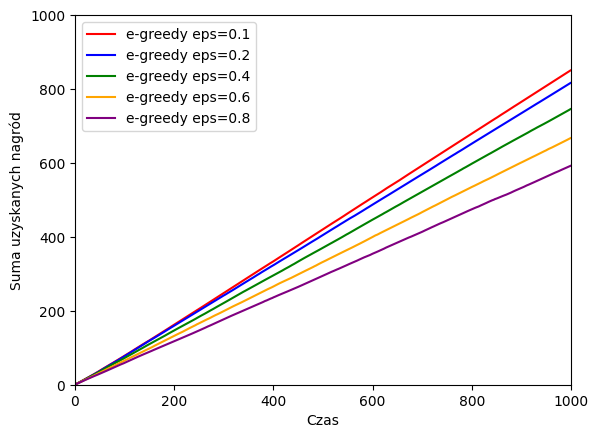
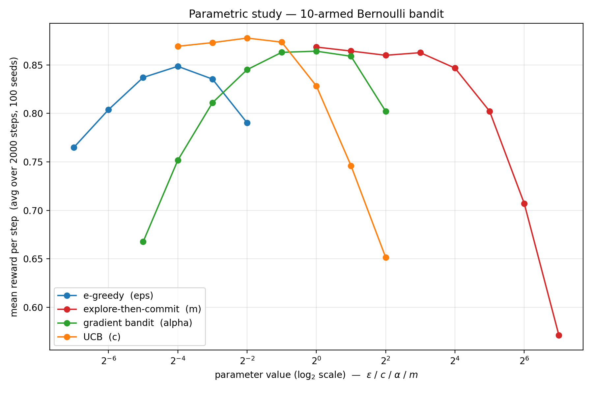
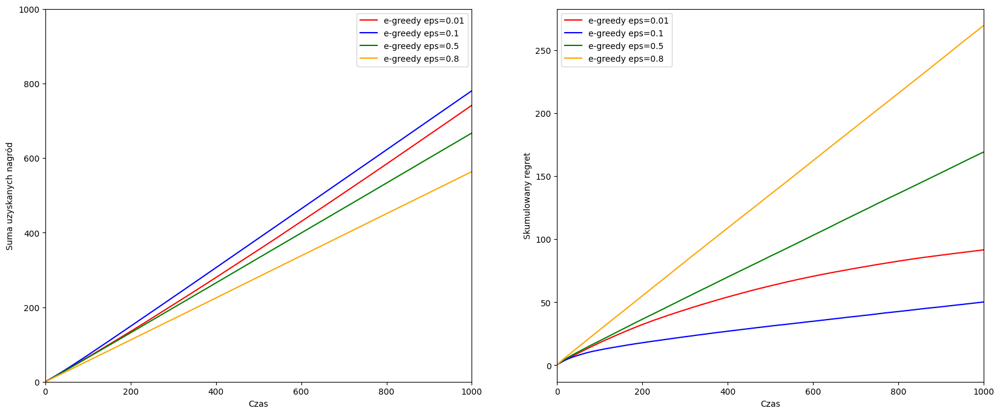
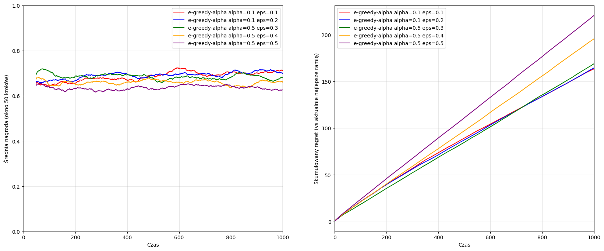
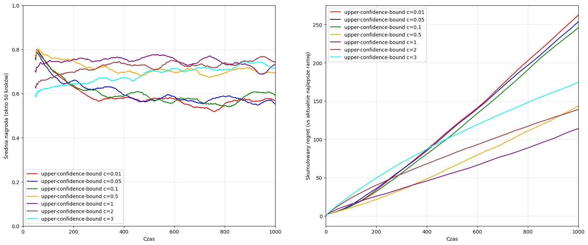

# Bandyci

W celu łatwiejszej i lepiej zorganizowanej implementacji, implementację poszczególnych bandytów umieściłem w osobnych plikach w folderze `bandits/`. Każdy z nich implementuje interfejs `BanditLearner`.

Zaimplementowałem następujących bandytów: EGreedy, EAlphaGreedy, ExploreThenCommit, Gradient, ThompsonSampling i UCB.

### Uruchomienie bandytów
Wywołania eksperymentów umieściłem w osobnych notatnikach, w celu zapewniania przejrzystości. Pierwszy notatnik `parameters_testing.ipynb` służy do wykonania eksperymentów, z użyciem zaimplementowanych bandytów, wraz z wizualizacją oraz możliwością dostowania parametrów.

Załączam tylko przykładowe komórki, wraz z rysunkiem:
```py
learners = [
    EGreedyLearner(eps=0.1),
    EGreedyLearner(eps=0.2),
    EGreedyLearner(eps=0.4),
    EGreedyLearner(eps=0.6),
    EGreedyLearner(eps=0.8),
]
for learner, color in zip(learners, colors):
    evaluate_learner(learner, color=color)
```


### Studium parametryczne

Przeprowadziłem proste studium parametryczne dla bandytów, których posiadają hiperparametry, min: UCB, EGreedy, czy Gradient. Wyniki przedstawiłem na jednym wykresie, oś pionowa (y) to średnia nagroda za krok (wyniki mocno uśrednione), a oś pozioma (x) to wartość parametru sterującego algorytmem, w skali $\log_2$. Rozważam parametry $\epsilon$, $c$, $\alpha$ i $m$ ,w zależności od algorytmu. Użyłem skali logarytmicznej, bo parametry zmieniają się o rzędy wielkości.



### Regret

Stworzyłem osobny notatnik `regret.ipynb` do wizualizacji skumulowanego żalu (regretu). Dla każdej próby losuję nowe prawdopodobieństwa sukcesu ramion (`random_potential_hits`), a następnie wyznaczam żal w danym kroku jako różnicę między najlepszą możliwą nagrodą oczekiwaną (maksimum z prawdopodobieństw ramion w danym problemie) a faktycznie uzyskaną nagrodą. Wartości akumuluję w czasie i uśredniam po `TRIALS_PER_LEARNER = 2000` przebiegach, aby zniwelować wpływ losowości.

```py
best_reward = max(bandit.potential_hits.values())
regrets = [best_reward - r for r in rewards]
cumulative_regret = list(accumulate(regrets))
```

Wyniki prezentuję na dwóch wykresach obok siebie — po lewej skumulowana suma nagród, a po prawej skumulowany żal w funkcji czasu. Takie zestawienie pozwala jednocześnie ocenić, jak szybko algorytm zbiera nagrody oraz jak bardzo odstaje od strategii optymalnej. W notatniku porównuję pojedyncze rodziny algorytmów dla różnych wartości hiperparametrów (np. $\epsilon$ dla EGreedy, $c$ dla UCB, $\alpha$ dla Gradient), a na końcu zestawiam wszystkie algorytmy z parametrami zbliżonymi do optymalnych.



### Bandyci niestacjonarni

W notatniku `non_stationary_distribution.ipynb` zmodyfikowałem problem tak, aby symulował stopniowy dryf preferencji odbiorców muzyki. W każdym kroku czasowym prawdopodobieństwa przesłuchania utworu do końca ulegają niewielkim zmianom, modelowanym jako błądzenie losowe (zakłócenia losowane z rozkładu normalnego). Wyniki z tego eksperymentu są bardzo ciekawe, ale intuicyjne i zrozumiałe.

```py
def reward(self, arm: str) -> float:
    thumb_up_probability = self.potential_hits[arm]
    reward = 1.0 if random.random() <= thumb_up_probability else 0.0

    for a in self.potential_hits:
        change = random.gauss(0, self.drift_std)
        self.potential_hits[a] = min(max(self.potential_hits[a] + change, 0.0), 1.0)

    return reward
```

Jeśli rozkład preferencji się zmienia, to algorytmy, które eksplorują tylko w początkowej fazie (a później eksplorują) nie będą radzić sobie zbyt dobrze. Stworzyłem wykresy obrazujące średnią z ostatnich 50 nagród. Widać na nich stopniowy wzrost oczekiwanej nagrody (faza eksploracji), następnie faza eksploatacji, w której stopniowo oczekiwana średnia nagroda staje się coraz mniejsza. Takie zachowanie zaobserwujemy np. w UCB, ExploreThenCommit, czy Thompson Sampling.

Świetnym rozwiązaniem na ten problem jest wykorzystanie EGreedyAlphaBandit, w którym świeższe obserwacje ważą więcej, starsze mają wagi zanikające wykładniczo. Taki algorytm dobrze radzi sobie z driftem.

Wszystkie wykresy są zawarte w pliku `non_stationary_distribution.ipynb`.


