## Implementacja SARSA

Zaimplementowałem min. funkcje do liczenia n-krokowego zwrotu zdyskontowanego oraz importance sampling ratio:

```python
# G - n-krokowy zwrot zdyskontowany
def _return_value(self, update_step):
    return_value = 0.0

    t = update_step
    end = min(t + self.step_no, self.final_step)
    for i in range(t + 1, end + 1):
        return_value += self.discount_factor ** (i - t - 1) * self.rewards[self._access_index(i)]
    if t + self.step_no < self.final_step: # bootstraping
        s = self.states[self._access_index(t + self.step_no)]
        a = self.actions[self._access_index(t + self.step_no)]
        return_value += self.discount_factor ** self.step_no * self.q[s, a]
    return return_value

# p - importance sampling ratio
def _return_value_weight(self, update_step):
    return_value_weight = 1.0

    t = update_step
    end = min(t + self.step_no, self.final_step)
    for i in range(t + 1, end):
        s_i = self.states[self._access_index(i)]
        a_i = self.actions[self._access_index(i)]
        actions = available_actions(s_i)

        pi = self.greedy_policy(s_i, actions)[a_i]
        b = self.epsilon_greedy_policy(s_i, actions)[a_i]
        return_value_weight *= pi / b
    return return_value_weight
```

## Corner B
Algorytm z sukcesem uczy się przejazdu przez trasę `corner_b`. Poniżej przedstawiam początkowe epizody (długie przejazdy) oraz te końcowe (z używaniem tylko optymalnej strategii, dodałem na końcu przeprowadzenie kilku ewaluacyjnych epizodów).


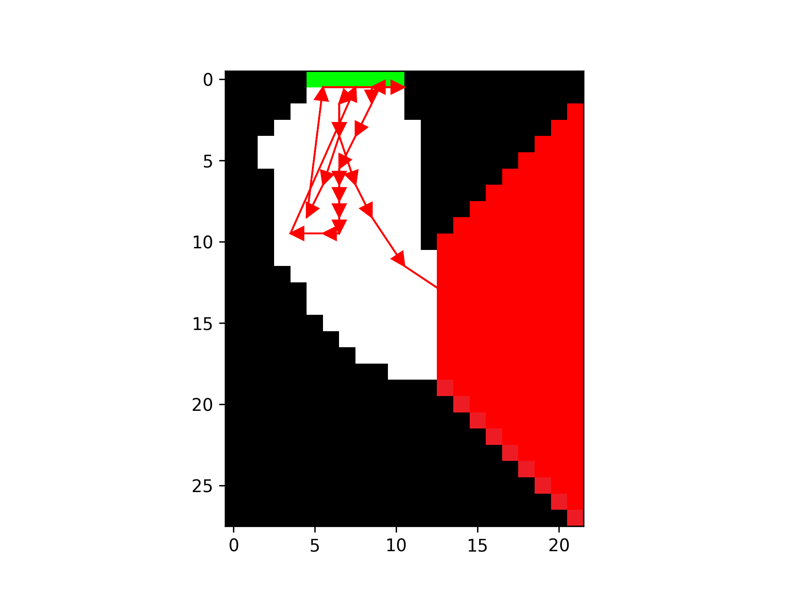

Trasa według optymalnej polityki (target policy)
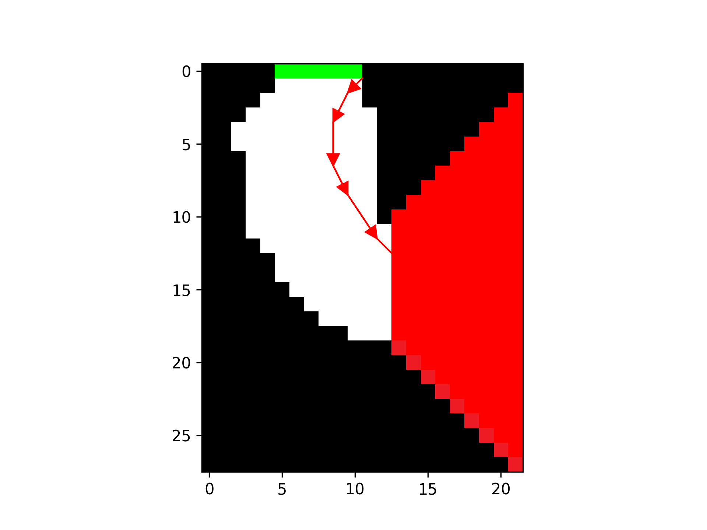

Podczas początkowych prac pojawił się problem, że samochód przejeżdżał przez sciany, ponieważ sprawdzał tylko, czy `car.next_position()` znajduje się na mapie, ale nie, czy piksele przez, które przechodzi też stanowią drogę. Narzędzia sztucznej inteligencji poradziły, by użyć prostego algorytmu sprawdzającego, czy na tej lini znajduje się przeszkoda, np. algorytm `DDA Line Drawing Algorithm`.

## Corner C

`corner_c` był już wiekszym problemem dla algorytmu. Pierwotna nauka trwała bardzo długo, zanim tak naprawdę algorytm odkrył drogę do mety - meta znajduje się znacznie dalej. Musiałem też na wybrać inne parametry, ustawiłem `step_no=5` i `experiment_rate=0.1`. Dla takich parametrów, cały trening (30000 epizodów) trwał około 40 minut. Oto przykładowe trasy, od początkowch, po optymalne. Widać też sporo powrotów na start, po uderzeniach w ścianę.

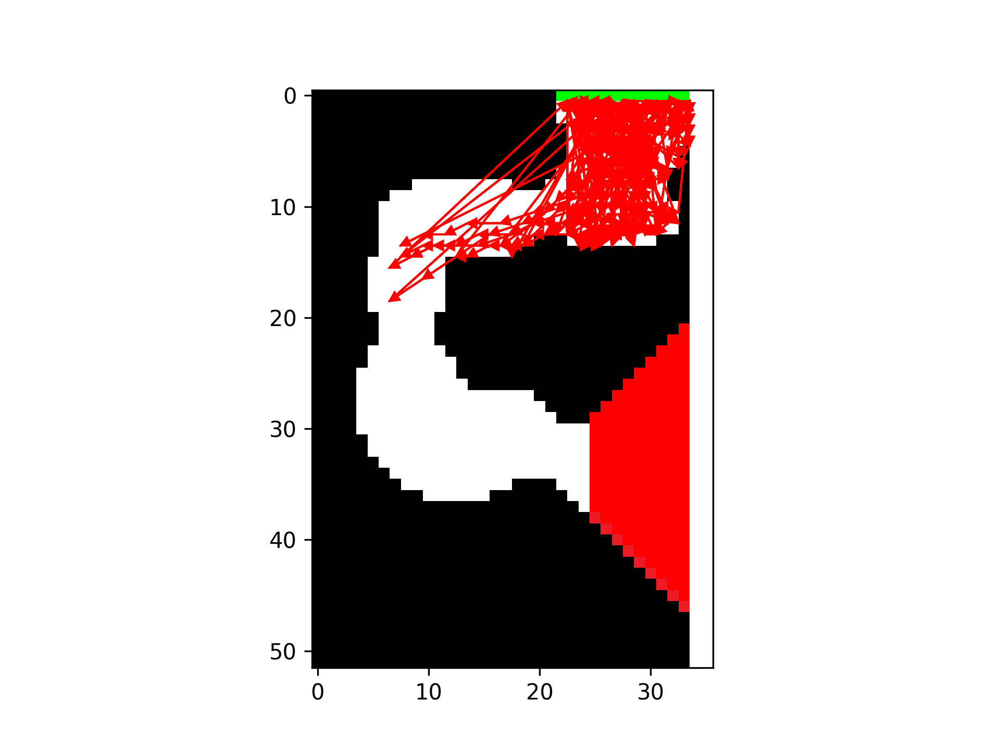
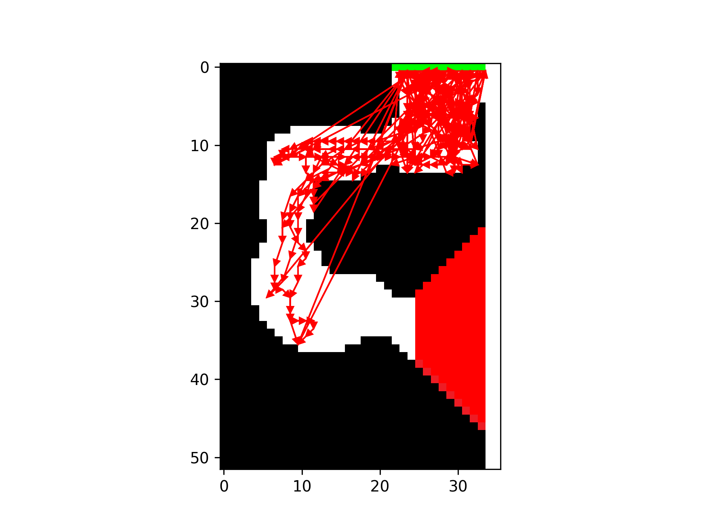


## Corner D
Podobnie jak w przypadku `corner_c`, także `corner_d` liczył się dość długo. W tym przypadku zostawiłem `step_no=2` i `experiment_rate=0.1`. Poniżej przedstawiam początkowe trasy, wraz z optymalną, wyuczoną polityką (target policy)

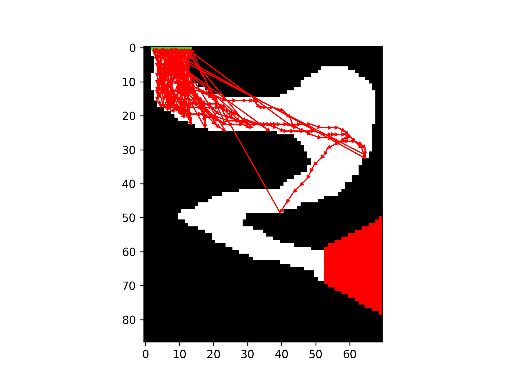
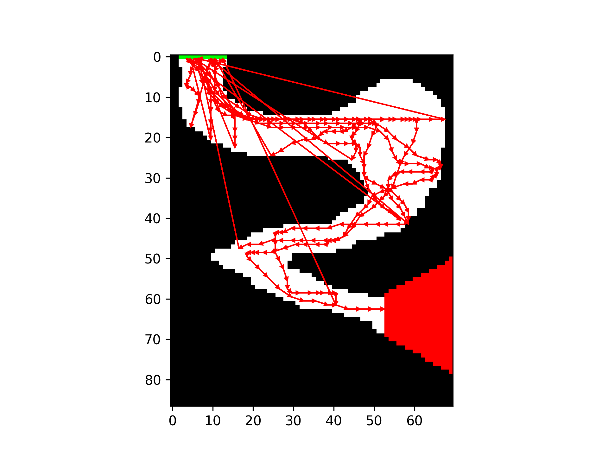

Trasa według optymalnej polityki (target policy)
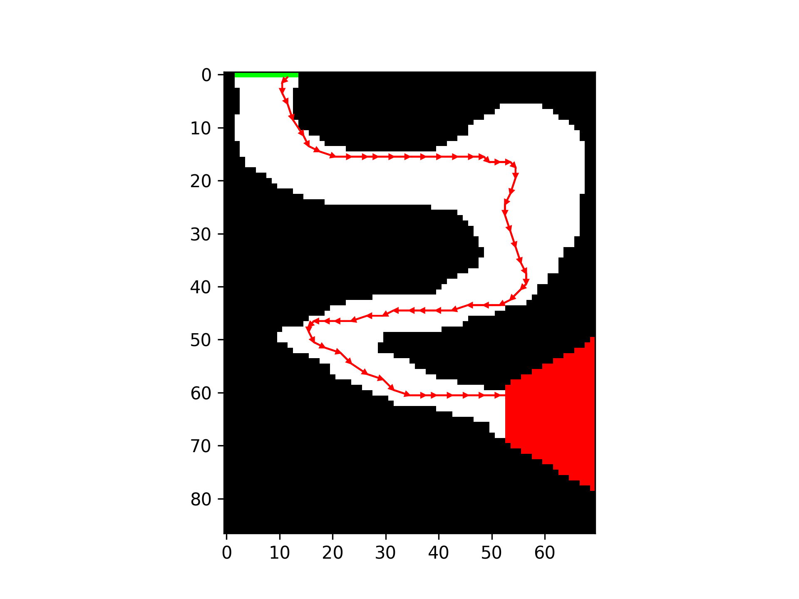

Finalna trasa robi już wrażenie. Przejazd jest dość spokojny i naturalny.

## Studium parametryczne

Tak jak już wspominałem wcześniej, czas liczenia jest dość długi. Postanowiłem studium parametryczne wykonać, w sposób automatyczny, na klastrze Ares, ponieważ mam do niego dostęp z przedmiotu Large Scale Computing.

```sh
#!/bin/bash
#SBATCH --job-name=sarsa-sweep
#SBATCH --output=sweep-%j.out
#SBATCH --error=sweep-%j.err
#SBATCH --nodes=1
#SBATCH --ntasks=1
#SBATCH --cpus-per-task=24
#SBATCH --mem=8G
#SBATCH --time=02:00:00

#SBATCH --account=plglscclass26-cpu
#SBATCH --partition=plgrid

source ~/.bashrc
conda activate plgpawlowiczfenv

cd $SLURM_SUBMIT_DIR
srun python parameters_study.py
```

Kod do studium parametrycznego znajduje się w `parameters_study.py`. Został napisany z pomocą narzędzi sztucznej inteligencji. Zapisuje wyniki obliczeń do pliku CSV, uśrednia wartości `penalties` dla uruchomień ewaluacyjnych. Pierwotnie sprawdzałem SARSE nawet z $n=16$, ale okazuje się, że pojawiają się numeryczne eksplozje (prawdopodobnie podczas liczenia Importance Sampling) - zmniejszyłem zatem do $n=8$. Im większa liczba kroków, tym dłużej trwają obliczenia.

Przykładowy wykres parametryczny dla `corner_b`:
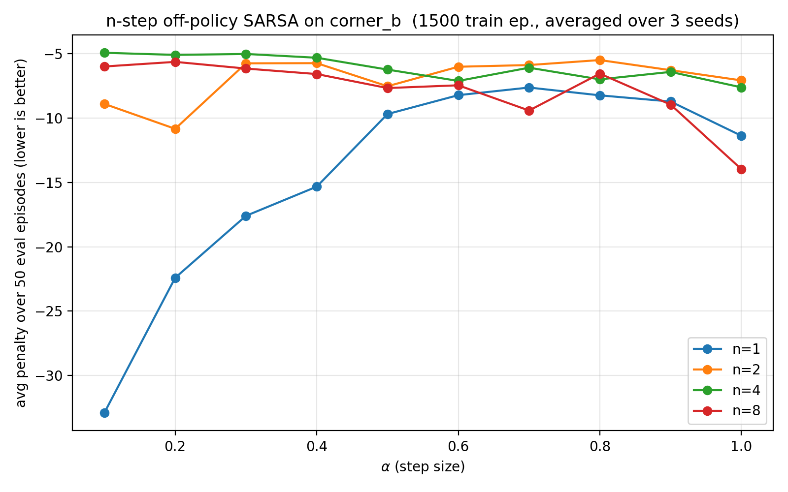

Dość dobrze poradziła sobie kombinacja `step_no` $=4$ i `step_size` $=0.1$.

Przykładowy wykres parametryczny dla `corner_d`:
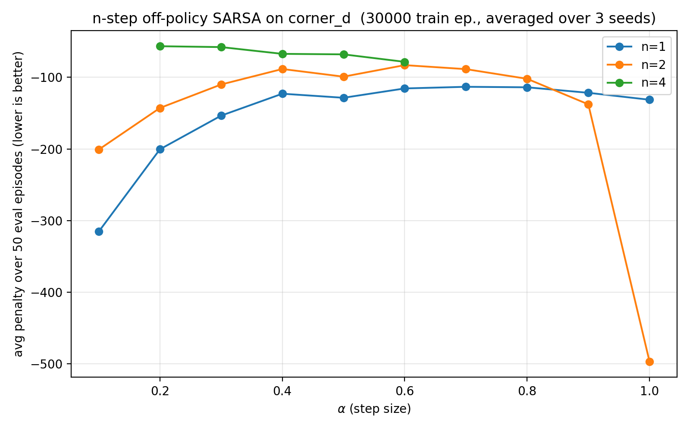
Tutaj podobnie, jak wcześniej, pojawiły się probly numeryczne przy IS - obliczenia zakończyłem na $n=4$ i $\alpha=0.6$.

## Polityka pędzenia do przodu

Do konstruktora klasy `OffPolicyNStepSarsaDriver` dodałem nowy parametr `behaviour`, który służy do podmiany polityki $b$: `epsilon` lub `rush`. Dzięki temu, dodałem metodę, która wybiera daną politykę np. podczas liczenia Importance Sampling:

```py
def behavior_policy(self, state: State, actions: list[Action]) -> dict[Action, float]:
    if self.behavior == "rush":
        return self.rushing_forward_policy(state, actions)
    return self.epsilon_greedy_policy(state, actions)
```

Implementacja wygląda podobnie, jak w przypakdu polityki `epsilon-greedy`. Do czynnika `greedy` dodajemy czynnik, który jest dodatni (różny od zera) dla tych akcji, dla których `a.x==1`. Polityka będzie zatem promować akcje, które oznaczają przyspieszenie w dół.
```py
# rushing-forward-policy
def rushing_forward_policy(self, state: State, actions: list[Action]) -> dict[Action, float]:
    greedy = self._greedy_probabilities(state, actions)
    rush = self._rush_probabilities(actions)
    probabilities = (1 - self.experiment_rate) * greedy + self.experiment_rate * rush
    return {action: probability for action, probability in zip(actions, probabilities)}

def _rush_probabilities(actions: list[Action]) -> np.ndarray:
    forward = np.array([1.0 if a.a_x == 1 else 0.0 for a in actions])
    if forward.sum() == 0:
        # edge case, fallback
        forward = np.ones(len(actions))
    return OffPolicyNStepSarsaDriver._normalise(forward)
```

Wykres ruchu takiego pojazdu, przy tej polityce, będzie wykazywał tendencję do przyspieszania w dół, co oznacza gorsze radzenie sobie przy zakrętach (bo wtedy należy wyhamowoać i skręcić). Przykładowo wykres ruchu:
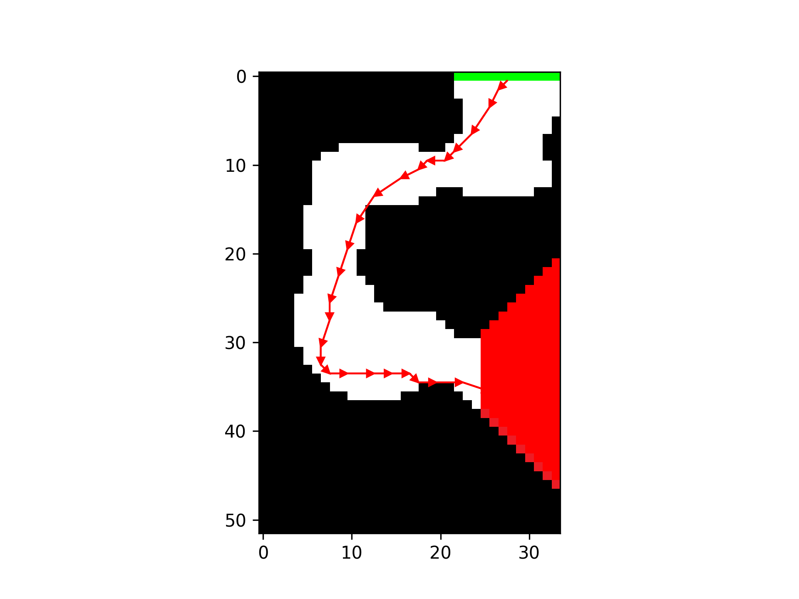

Jeśli chodzi o nie liczenie IS, to do konstruktora dodałem flagę `self.importance_sampling: bool`. Wyłączenie IS oznacza, że współczynnik $\rho$ ma zawsze wartość 1.0. W efekcie każda aktualizacja Q wykorzystuje pełną różnicę (G - Q), bez uwzględniania tego, jak bardzo polityka $b$ różni się od $\pi$. Zamiast zbiegać do $Q_{\pi}$, algorytm zbiega do wartości bliższych $Q_{b}$, czyli takich, które odpowiadają polityce $b$. W praktyce oznacza to, że stany-akcje typu "jedź dalej prosto" tuż przed zakrętem dostają niższą wartość, ponieważ przy polityce $b$ często kończyły się wypadkiem. W efekcie końcowa polityka zachłanna (greedy) jest bardziej ostrożna niż w czystym podejściu off-policy z IS.

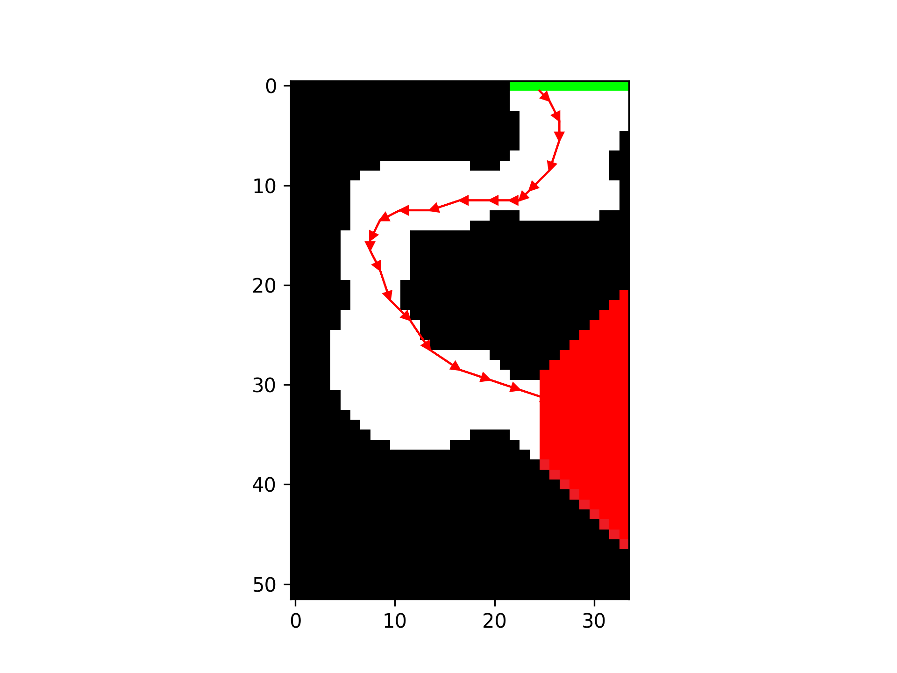