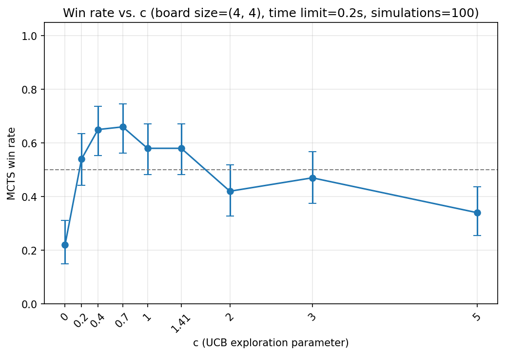
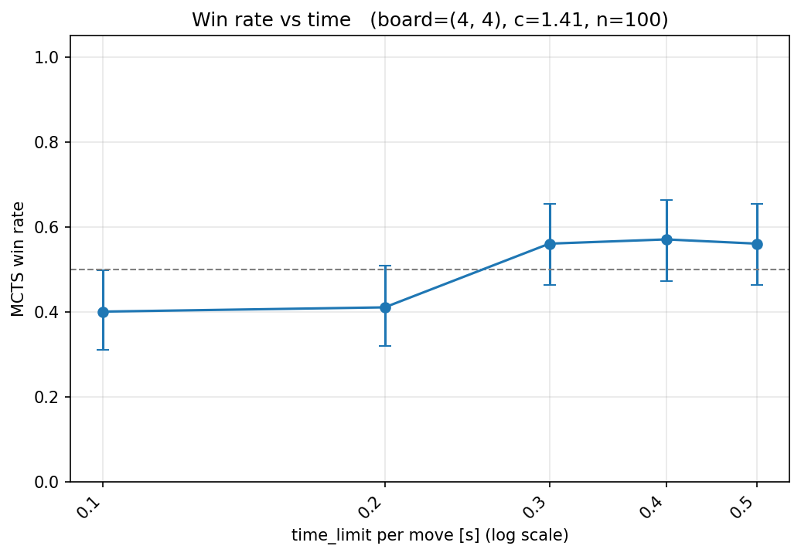
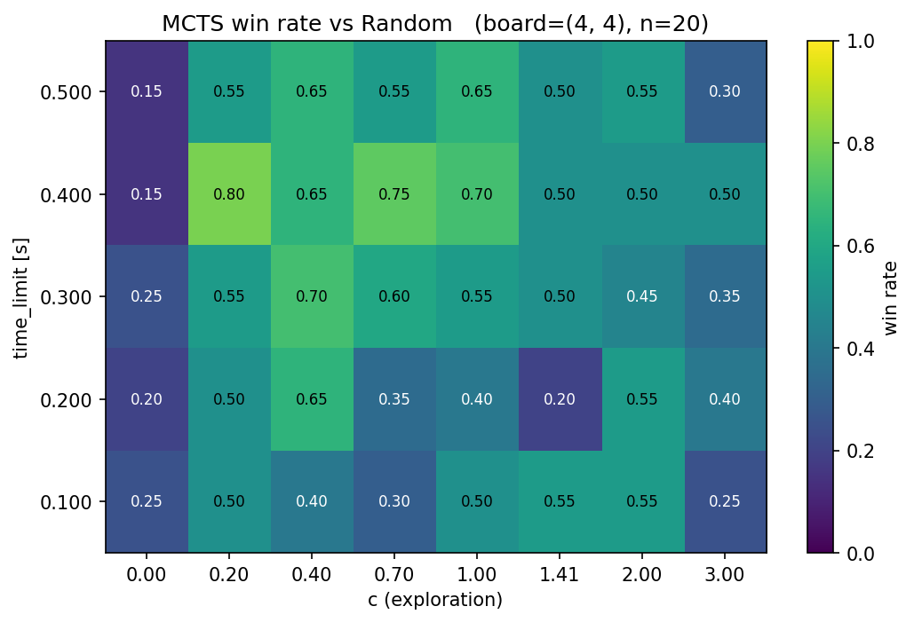
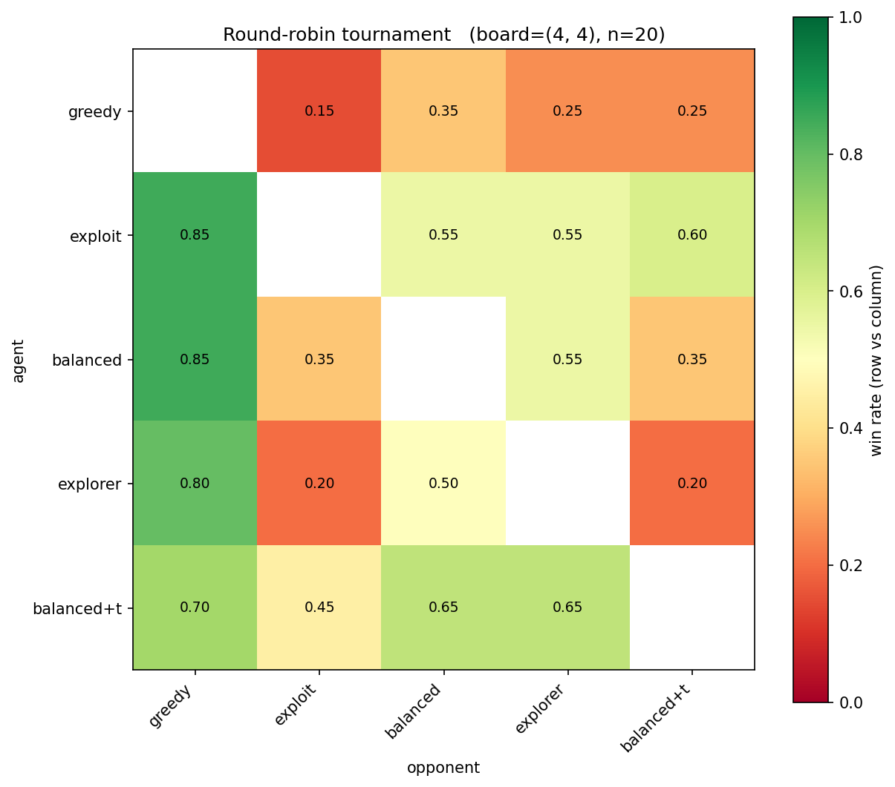

# Przeszukiwanie drzewa metodą Monte Carlo (MCTS)
Monte Carlo Tree Search

Składa się z czterech kroków: selekcji (selection), rozwinięcia (expansion), symulacji (simulation/rollout) i propagacji wstecznej (backpropagation).

## Raport

Zaimplementowałem wymagane etapy algorytmu MCTS. W przypadku selekcji, wartość pola `value` w dzieciach, to tak naprawdę wartościowanie stanu przeciwnika, dlatego brałem, podczas liczenia UCB, wartość wyrażenia $(1-value)$:

`(1 - child.value) + self.c_coefficient * math.sqrt(math.log(self.times_chosen) / child.times_chosen)`. Cały kod znajduje się w pliku `isolation.py`.

Po pierwszych uruchomieniach widać, że gracz MCTS miażdzy do zera przeciwnika losowego, co już świadczy o nieco bardziej intetligentnych ruchach. Przeprowadziłem kilka testów wyników gry między graczami MCTS, różniącymi się wartościami parametrów `time_limit`, czy `c_coefficient`. Różne, przykładowe wywołania testowe umieszczałem w osobnych funkcjach, oznaczanych, jako `ex01()`, `ex02()` itd.

Funkcje do wizualizacji zostały umieszczone w pliku `visualizations.py`.

## Wykresy

Pierwszy wykres to turniej gracza MCTS o zmieniającej się wartości współczynnika $c$ z agentem MCTS o stałej wartości współczynnika $c=1.41$ i takiej samej wartości `time_limit` $=0.2$. Zgodnie z przeprowadzonymi testami, najlepsza wartość mieści się w przedziale $[0.4,0.7]$.

###

Drugim wykresem jest także turniej gracza MCTS o zmieniającej się, tym razem, wartości `time_limit` z agentem MCTS o stałej wartości `time_limit`$=0.3$. Tutaj rezultaty pokazują, że nieco lepiej radzą sobie gracze z największym czasem np. $0.5$.

###

Wykres przedstawiający heatmapę z kombinacjami parametrów gracza MCTS, przy pojedynku z graczem MCTS o parametrach $(0.3, 1.41)$ (tytuł wykresu jest nieco błędny)

###
Ostatnim przeprowadzonym testem jest pojedynek już dwóch zmieniających się graczy MCTS. Każdy z nich posiada różne cechy: większy `time_limit`, mniejszy współczynnik $c$ itd.

    {"label": "greedy",      "time": 0.1, "c": 0.0},
    {"label": "exploit",     "time": 0.1, "c": 0.4},
    {"label": "balanced",    "time": 0.1, "c": 1.41},
    {"label": "explorer",    "time": 0.1, "c": 3.0},
    {"label": "balanced+t",  "time": 0.3, "c": 1.41},

