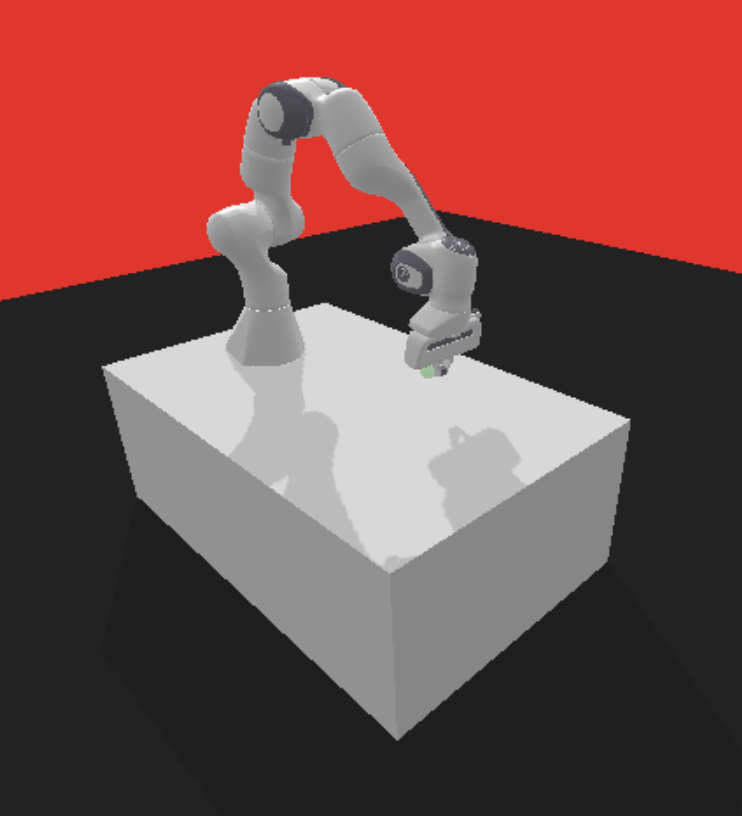

# Rozwiązanie
W projekcie zaimplementowałem, dodałem zmiany dot. Soft Actor Critic (SAC) i Hindsight Experience Replay (HER).

# Hindsight Experience Replay (HER)

HER to algorytm zaprojektowany do rozwiązywania problemów z rzadką nagrodą, szczególnie w zadaniach opartych na celach (goal-based). W takich zadaniach agent dostaje nagrodę tylko wtedy, gdy osiągnie dokładnie wyznaczony cel, co sprawia, że przy trudnych celach nie jest w stanie przeszukać przestrzeni stanów wystarczająco efektywnie (autorzy pracy jako przykład wskazują bit-flipping problem).

HER opiera się na prostej obserwacji: nawet jeśli agent nie osiągnął zamierzonego celu, to przeszedł przez pewną trajektorię stanów $s_1, s_2, \ldots, s_T$. Algorytm w pliku `buffers.py` przechowuje przejścia takich epizodów w postaci krotki $(s_t, a_t, r_t, s_{t+1}, g)$. Kluczowym krokiem jest podmiana celu $g$ na inny, wybrany zgodnie z przyjętą strategią, i zapisanie zmodyfikowanego przejścia do bufora.

Zaimplementowałem dwie strategie podmiany celu: `future` i `final`. Strategia `final` traktuje ostatni osiągnięty stan epizodu jako cel. Strategia `future` wybiera losowo dowolny stan osiągnięty później w tym samym epizodzie - przykładowo dla przejścia ze stanu $s_i$ nowym celem może być dowolny stan $s_{i+1}, \ldots, s_T$.

```python
if self.selection_strategy == "final":
    # in 'final' we treat last state of the episode as the goal
    next_idx = T - 1
elif self.selection_strategy == "future":
    if curr_idx == T - 1:
        break
    next_idx = np.random.randint(curr_idx + 1, T)
```

Podsumowując pracę nad tą częścią, uważam, że algorytm jest naprawdę ciekawy i intuicyjny. Sygnał nagrody jest gęstszy - bez HER agent prawie nigdy nie  zobaczyłby nagrody $r=0$, więc sieć Q nie miałaby czego się uczyć i trening utknąłby w miejscu. Trudności sprawiało jedynie poruszanie się po złożonej strukturze klas - indeksach, zagnieżdżonych słownikach i powiązaniach między polami, nie były to jednak trudności merytoryczne.

# Soft Actor Critic (SAC)

SAC to algorytm aktor-krytyk typu off-policy dla ciągłych przestrzeni akcji. Oprócz maksymalizacji zwrotu, agent maksymalizuje również entropię swojej polityki, co zachęca go do eksploracji. Cel uczenia ma postać $J(\pi) = \sum_t \mathbb{E}\big[r_t + \alpha \mathcal{H}(\pi(\cdot|s_t))\big]$. Autorzy pracy motywują algorytm pisząc: `Actor aims to maximize expected reward, while also maximizing entropy. That is, to succeed at the task while acting as randomly as possible`.

Mój kod w pliku `algos.py` implementuje wariant SAC - z parą sieci krytyka i braniem minimum przy backupie, bez osobnej sieci wartości $V$. Trzy główne straty liczone w `update()` to:
- strata krytyka $J_Q$ z miękkim backupem $r + \gamma(1-d)(Q_\text{targ}(s', a') - \alpha \log\pi(a'|s'))$,
- strata polityki $J_\pi = \mathbb{E}[\alpha \log\pi - Q]$
- strata temperatury $J_\alpha$.

Jest także automatyczne strojenie temperatury $\alpha$. W pierwszym papierze o SAC była ona stałym hiperparametrem do ręcznego dobrania pod każde środowisko. W nowszym wariancie traktuje się ją jako zmienną uczoną gradientowo tak, aby entropia polityki utrzymywała się w okolicach zadanego poziomu.
```python
self.log_alpha = torch.nn.Parameter(self.alpha.clone().log())
self.alpha_optimizer = torch.optim.Adam([self.log_alpha], lr=lr)
```

Sama strata $J_\alpha$:
```python
alpha_loss = torch.mean(-self.log_alpha * (logp_pi + self.target_entropy).detach())
```

Podsumowując pracę nad tą częścią, algorytm trochę mnie przerósł. Starałem się zrozumieć część artykułu naukowego i mimo że jest napisany bardzo dobrze, ze względu na niewystarczającą wiedzę w tej dziedzinie nie udało mi się to w pełni. Mam nadzieję, że z czasem dokładne zrozumienie wszystkich aspektów będzie możliwe. W pracy nad tą częścią wspomagałem się narzędziami AI.

# Trening

Treningi przeprowadzałem na maszynie Ares. Stworzyłem dodatkowy plik `play.py`, który pozwala na odtworzenie, render animacji po zakończonym treningu.

Początkowo ustawiłem `n_steps = 100_000`. Drugi trening przeprowadziłem na `n_steps = 3_000_000`. W obu przypadkach test dla `PandaReach-v3` dał sukces $100\%$ - potwierdza to poprawność implementacji. `PandaPush-v3` także działa świetnie, chociaż tylko dla przypadku z `n_steps=3_000_000`. Niestety, dla obu przypadków, test dla bardziej skomplikowanych środowisk okazał się słaby. Na plus, agent nie wykonuje losowych, chaotycznych ruchów, ale też nie radzi sobie z postawionym celem. W środowiskach z prefixem `Fetch`, nie radzi sobie zupełnie. Są to złożone środowiska, `n_steps` jest za małe.

```
PandaReach-v3

Mean episode return: -1.4
Mean episode length: 2.4
Success rate: 100.00%

---

PandaPush-v3
Mean episode return: -7
Mean episode length: 8
Success rate: 100.00%

---

PandaPickAndPlace-v3

Mean episode return: -38.2
Mean episode length: 38.5
Success rate: 30.00%
```



Przykładowe wywołanie renderu animacji:
`python play.py --env "PandaPush-v3" --checkpoint "panda-push-v3.pt" --episodes 10 --sleep 0.02`