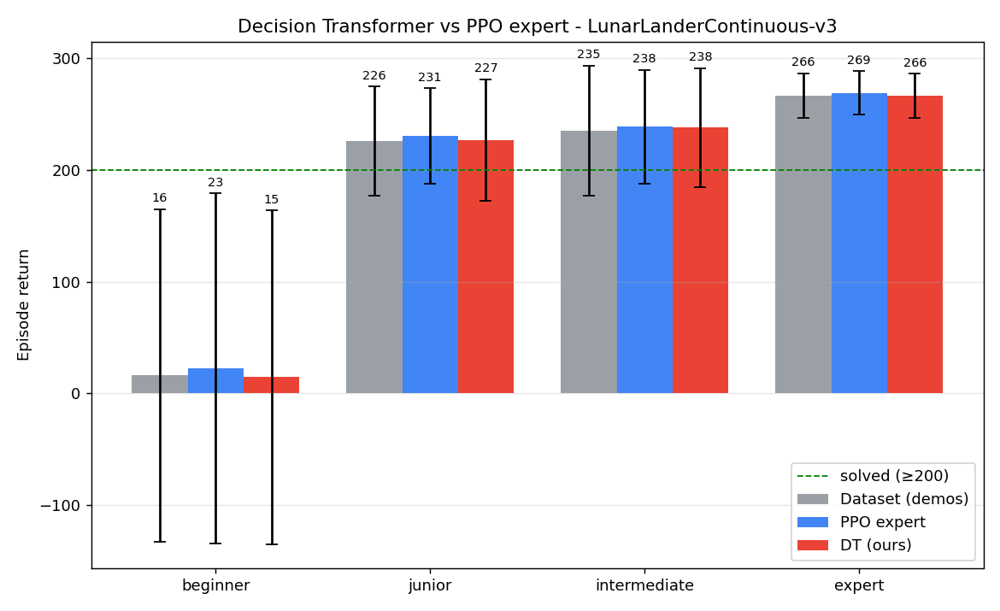

### Wprowadzenie

Jako środowisko wybrałem klasycznego `LunarLander-v3`, ale w wersji ciągłej. Akcje to już wektor liczb rzeczywistych, nie wartości 0/1.

### Zbieranie demonstracji

Do wytrenowania bazowych agentów wykorzystałem algorytm PPO ze Stable Diffusion. Przygotowany kod umieściłem w pliku `train_lunarlander.py`. Umożliwia on nie tylko trening, ale również oglądanie wytrenowanego modelu: `uv run python .\train_lunarlander.py --load --run-name "ppo_LunarLanderContinuous-v3_100k_s0" --watch`. Wytrenowałem czterech agentów na rożnych poziomach (tj. do określonej liczby `timesteps`): beginner, junior, intermediate i expert, których `timesteps` wynosił odpowiednio: 100k, 200k, 400k, 1000k kroków. 

```py
def train(env_id, timesteps, model_path, seed, tb_dir, run_name, n_envs):
    env = make_vec_env(env_id, n_envs=n_envs, seed=seed)

    # PPO agent. "MlpPolicy" = a small fully-connected net, the right choice
    # when observations are vectors (not images).
    model = PPO(
        policy="MlpPolicy",
        env=env,
        verbose=1, # print the training table each update
        seed=seed,
        tensorboard_log=tb_dir,
    )


    model.learn(total_timesteps=timesteps, progress_bar=True, tb_log_name=run_name)

    # Save weights + hyperparameters to a single .zip (path gets a .zip suffix).
    model.save(model_path)
    print(f"[save] model -> {model_path}.zip")
    print(f"[save] tb logs -> {Path(tb_dir) / (run_name + '_1')}")
    env.close()
    return model
```

### Zapisanie demonstrancji

Do zapisania demonstrancji użyłem Minari. Jest to wygodny sposób na przechowywanie danych z demonstracjami, integruje się bezpośrednio z Gym. Kod do zapisu umieściłem w pliku `collect_minari.py`. Jest on także dość elastyczny, umożliwia zbieranie dowolnej liczby demonstrancji z różnych modeli. Przykładowe wywołanie to: `uv run python collect_minari.py --run-name ppo_LunarLanderContinuous-v3_100k_s0 --dataset-id lunarlander/ppo_beginner_100k-v0 --num-episodes 1000`, gdzie `run-name` to lokalizacja modelu PPO w katalogu `/models`, a `dataset-id` to nazwa zbioru pod jaką zapisać demonstrancje. Dla beginner, intermediate i expert zebrałem po 1000 epizodów, dla juniora było to 10_000. 

### Trening Decision Transformera 
Do treningu użyłem biblioteki NanoDTAgent, wzorowałem się na przykładach z repozytorium z katalogu `examples/`. Liczba iteracji wynosiła 200_000, użyłem także nieco zmienionego `reward_scale`. 
```py
def train_dt(dataset_id, model_path):
    seed = 1234
    seed_libraries(seed)
    minari_dataset = minari.load_dataset(dataset_id)

    os.makedirs(os.path.dirname(model_path), exist_ok=True)

    dt_agent = NanoDTAgent(device="cpu")

    # reward_scale divides returns-to-go fed to the model. LunarLander returns
    # are ~200-300, so a smaller scale keeps them sane.
    # max_iters: trainer default is 100k, far too slow on CPU; keep it modest.
    dt_agent.learn(
        minari_dataset,
        reward_scale=100.0,
        max_iters=200_000,
        warmup_iters=1_000,
    )
    dt_agent.save(model_path)
    print(f"Model saved to: {model_path}")
```

### Ewaluacja

W pliku `evaluate_dt.py` umieściłem funkcje, które pozwalają wykonać epizody na wyuczonym DT, który jest wczytywany z pliku `.pth`. Domyślnie, na początku, używam wartości `Return To Go`, obliczenego następująco:
```py
def target_return_from_dataset(dataset, top_frac=0.1):
    """
    Algorithm to calculate return-to-go:
    1) take every trajectory in the data
    2) compute each trajectory's return (sum of rewards)
    3) take the top `top_frac` (best 10%) of those returns
    4) average them
    """
    returns = np.array([ep.rewards.sum() for ep in dataset.iterate_episodes()])
    k = max(1, int(len(returns) * top_frac))
    top = np.sort(returns)[-k:]
    return float(top.mean())
```

Funkcja do ewaluacji jest także dość intuicyjna:
```py
def evaluate(dataset_id, model_path, env_id):
    dataset = minari.load_dataset(dataset_id)
    target_return = target_return_from_dataset(dataset)
    print(f"R̂₁ (mean return of top 10% trajectories) = {target_return:.1f}")

    env = gym.make(env_id)
    agent = NanoDTAgent.load(model_path)

    for episode in range(5):
        agent.reset(target_return=target_return)
        obs, _ = env.reset()
        done = False
        total_reward = 0
        rew = None
        while not done:
            # Pass the previous step's reward so the DT decreases its return-to-go.
            action = agent.act(obs, rew)
            obs, rew, ter, tru, _ = env.step(action)
            done = ter or tru
            total_reward += rew

        print(f"Episode {episode + 1}: total reward = {total_reward:.1f}")
```

Przygotowałem także (z pomocą AI) różne skrypty do uruchamiania i porównywania DT z bazowo wytrenowanym agentem przy pomocy PPO. Stworzyłem także skrypt do zapisywania filmików z epizodów. 

Wywołanie `uv run python compare_dt.py --episodes 50` umożliwia porównanie wytrenowanego DT z bazowym agentem wytrenowanym przez PPO. 
```sh
┏━━━━━━━━━━━━━━┳━━━━━━━━━━━━━━━━━┳━━━━━━━━━━━━┳━━━━━━━━━━━┳━━━━━━━━━━━┳━━━━━━━━━━━━┓
┃ Level        ┃ Dataset (demos) ┃ PPO expert ┃ DT (ours) ┃ DT vs PPO ┃ DT solved% ┃
┡━━━━━━━━━━━━━━╇━━━━━━━━━━━━━━━━━╇━━━━━━━━━━━━╇━━━━━━━━━━━╇━━━━━━━━━━━╇━━━━━━━━━━━━┩
│ beginner     │        16 ± 149 │   23 ± 157 │  15 ± 149 │        -8 │        20% │
│ junior       │        226 ± 49 │   231 ± 43 │  227 ± 54 │        -4 │        88% │
│ intermediate │        235 ± 58 │   238 ± 51 │  238 ± 53 │        -1 │        94% │
│ expert       │        266 ± 20 │   269 ± 19 │  266 ± 20 │        -3 │       100% │
└──────────────┴─────────────────┴────────────┴───────────┴───────────┴────────────┘
```

Wnioski:
- DT skutecznie imituje eksperta PPO. Na poziomach junior, intermediate i expert DT osiąga wyniki zbliżone do PPO (różnica 1-4 punkty), co stanowi solidny wynik dla podejścia offline RL. Na poziomie expert DT rozwiązuje 100% epizodów.
- DT nie przekracza jakości danych treningowych. Zgodnie z oczekiwaniami dla modeli offline, DT nie jest w stanie przewyższyć agenta PPO. Wynika to z natury uczenia się przez imitację - model odtwarza wzorce z danych, nie eksploruje środowiska.

Okazało się także, że warunkowanie, zmiana wartości return-to-go (RTG) nie działa - nie ma wpływu na wynik, nagrody w epizodzie. DT nauczył się ignorować token RTG, gdyż w danych prawie zawsze były wysokie nagrody. Model ekstrapoluje zachowanie eksperta niezależnie od podanego RTG. Jedynie zastanawiam się, co było powodem, dla którego RTG nie poprawił epizodów np. dla beginnera, którego odchylenie wartości nagród było duże.

Podsumowując, wytrenowany Decision Transformer skutecznie dorównuje oryginalnemu agentowi PPO, na którego epizodach się uczył. Na poziomie expert, gdzie dane treningowe były wysokiej jakości i stabilne (266 ± 20), DT osiąga identyczną średnią nagrodę (266 ± 20) i ląduje skutecznie w 100% epizodów, co oznacza pełne dorównanie mistrzowi. Na poziomach junior i intermediate różnica względem eksperta PPO wynosi odpowiednio 4 i 1 punkt, co również można uznać za bardzo dobry wynik.
Na poziomie beginner DT radzi sobie wyraźnie gorzej - rozwiązuje jedynie 20% epizodów. Wynika to z niskiej jakości i dużej niestabilności danych treningowych (16 ± 149), gdzie chaotyczne trajektorie utrudniają modelowi nauczenie się spójnej polityki.

DT nie przekracza wyników PPO na żadnym poziomie, co jest oczekiwanym zachowaniem dla metod offline RL - model jest ograniczony jakością danych i nie eksploruje środowiska samodzielnie. Niemniej wyniki pokazują, że DT skutecznie odtwarza zachowanie demonstratora: na wysokiej jakości danych potrafi w pełni dorównać ekspertowi, który te dane wygenerował.

